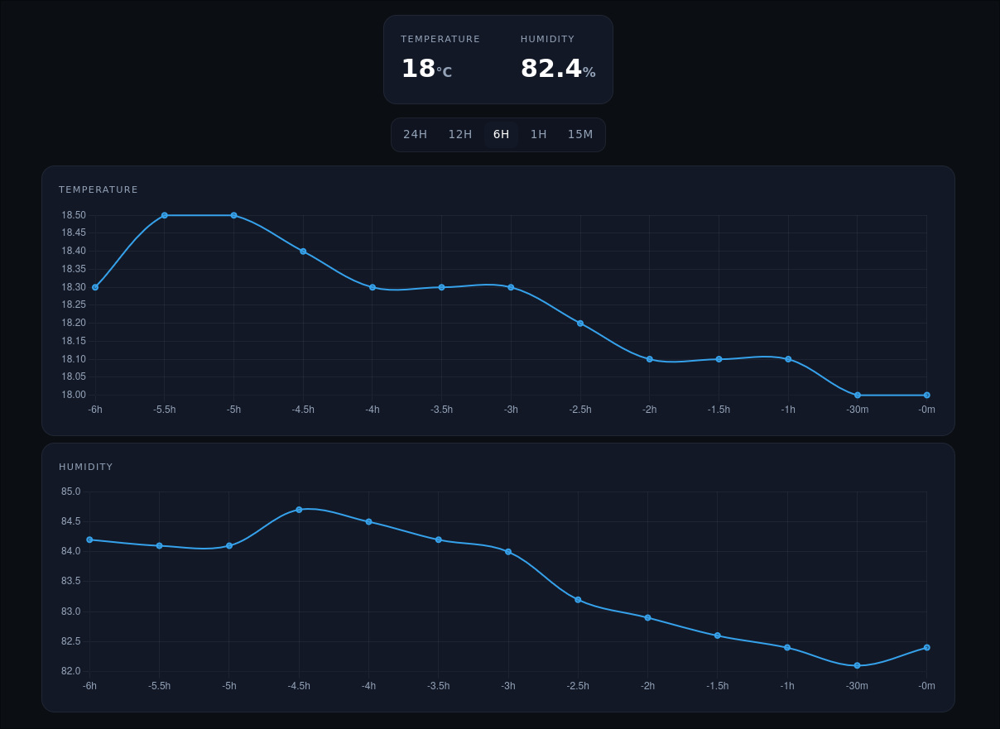
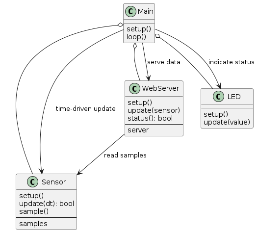

# ESP8266 Temperature Web Server



## Features

- View current temperature and humidity and see trends in recent data with graphs
- Select from multiple time ranges ranging from 24 hours to 15 minutes

## Design


This project uses an ESP8266-12F board which has built-in WiFI capabilities.
This allows it to connect to the internet and serve a webpage to clients on
the local network.



I engineered the project by creating three proof-of-concepts, one for each
major milestone in the project: setting up the board with a serial connection,
collecting data on the DHT22 sensor and running a simple web server on the chip.
Then, I integrated all the pieces together using object-oriented programming
to simplify the interfaces between the project's main components.

One of the main difficulties of this project was managing tight memory
constraints. The ESP8266-12F has limited static memory and available heap
memory, so the website code needed to be concise, and I had to avoid unnecessarily
copying data wherever possible. Thus, I traded higher connectivity between the
Sensor and WebServer interfaces to save some memory—I previously copied data to avoid
coupling, and I sent the website code to the client in several steps to avoid
loading the entire website into the heap.

## Setup

Create a file named `./include/secrets.h` with the following:

```cpp
#ifndef SECRETS_H
#define SECRETS_H

#define WIFI_SSID "<your WIFI SSID>"
#define WIFI_PASSWORD "<your WIFI password>"

#endif // SECRETS_H
```

Upload the program onto an ESP8266-12E-style board via platformio:

```bash
pio run --target upload
```

The program will output the server address to a serial monitor.
You can also find it on your router's homepage.
